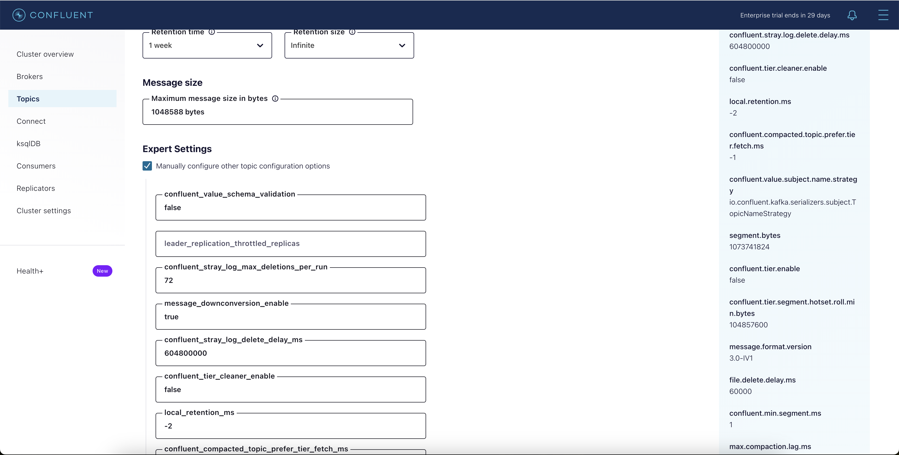
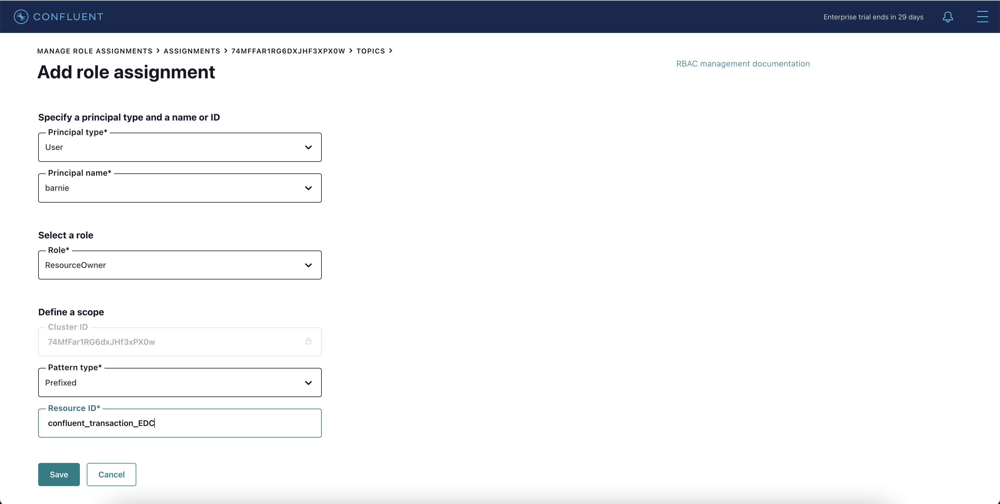

<div align="center" padding=25px>
    
</div>

# <div align="center">Topic and Schema on Kafka</div>

## <div align="center">Workshop guide</div>

# Introduction

In this Workshop we'll be get to know what is the best practice of Topics and Schema in Kafka. Each part highlighted somes configuration for Kafka Topics or Schema and how does it works.

Architecture
<div align="center" padding=25px>
    
</div>

## **Agenda**
1. [Access Control Center](#step-1)
2. [Replication Factor](#step-2)
3. [Min In-sync Replicas](#step-3)
4. [Partitions](#step-4)
5. [Log Segment](#step-5)
6. [Topic Naming](#step-6)
7. [Clean-up Policy](#step-7)
8. [Schema Management](#step-8)

***

## <a name="step-1"></a>Access Control Center

1. Go to Control Center that has been provided
```bash
http://ec2-108-137-44-163.ap-southeast-3.compute.amazonaws.com:9021
``` 

2. Login to the Confluent Cluster
```bash
superUser:superUser
```

3. Click the Cluster that will be used on this Workshop

## <a name="step-2"></a>Replication Factor

1. Create Topic by add topic on the topic page

2. Set the name **topic_rf_<your_name>**

3. Click **Advanced Settings**
<div align="center" padding=25px>
    
</div>

4. Scroll down and click Custom Availability Settings and set 3 replication_factor and 2 min_insync_replicas
<div align="center" padding=25px>
    
</div>

5. Click the topic name and see the overview
<div align="center" padding=25px>
    
</div>

6. Now create the same topic with topic name **topic_rpc_<your_name>** with using replica placement constraints
<div align="center" padding=25px>
    
</div>

<div align="center" padding=25px>
    
</div>

<div align="center" padding=25px>
    
</div>

```bash
{
    "version": 2,
    "replicas": [
        {
            "count": 1,
            "constraints": {
                "rack": "r1"
            }
        },
        {
            "count": 1,
            "constraints": {
                "rack": "r2"
            }
        }
    ],
    "observers": [
        {
            "count": 1,
            "constraints": {
                "rack": "r3"
            }
        }
    ],
    "observerPromotionPolicy":"under-min-isr"
}
```

7. Click the new topic name and see the overview
<div align="center" padding=25px>
    
</div> 

Question:
- What is the different between topic_rf and topic_rpc?
- How to create the best availability using the replica placement?

## <a name="step-3"></a>Min-Insync Replica

1. Create Topic by add topic on the topic page

2. Set the name **topic_minisr_<your_name>**

3. Click **Advanced Settings**
<div align="center" padding=25px>
    
</div>

4. Scroll down and click Custom Availability Settings and set 1 replication_factor and 1 min_insync_replicas
<div align="center" padding=25px>
    
</div>

5. Access your instance using ssh (Putty, MobaXTerm, etc.)

6. Produce some data to the topic
```bash
kafka-console-producer --bootstrap-server 10.0.32.58:9094 --topic topic_minisr_<your_name>
```

7. Create another new topic **topic_minisr2_<your_name>** and set 2 replication_factor and 3 min_insync_replicas
<div align="center" padding=25px>     
    
</div>

8. Access your instance using ssh (Putty, MobaXTerm, etc.)

9. Produce some data to the topic
```bash
kafka-console-producer --bootstrap-server 10.0.32.58:9094 --topic topic_minisr2_<your_name>
```

Question:
- How to make the new topic works again?

## <a name="step-4"></a>Partition

1. Create Topic by add topic on the topic page

2. Set the name **topic_partition_<your_name>**

3. Create the topic with 3 partitions and replication_factor 2 with min_insync_replicas 1

4. Create new topic with topic name **topic_partition2_<your_name>** and using 3 partitions and replication_factor 3 with min_insync_replicas 2

5. Change the number of partition from 3 to 4 from your instance
```bash
kafka-topics --bootstrap-server 10.0.32.58:9094 --topic topic_partition2_<your_name> --alter --partitions 4
```
<div align="center" padding=25px>     
    
</div>

Question:
- What is the keypoint of topic_partition and topic_partition2?
- How to reduce or shrink the partition on topic_partition2 from 4 to 3?

## <a name="step-5"></a>Log Segment

1. Create Topic by add topic on the topic page

2. Set the name **topic_logs_<your_name>** with the best availability replica placement constraint

3. On the expert setting make sure that the **segment_bytes** have value 1073741824
<div align="center" padding=25px>     
    
</div>

4. Produce some data to the topic
```bash
kafka-console-producer --bootstrap-server 10.0.32.58:9094 --topic topic_logs_<your_name>
```

5. Cleanup the data by change the topic configuration on **Retention time** from 1 week to 0.001 Hours and click **Save changes**
<div align="center" padding=25px>
    
</div>

Question:
- After 0.001 Hours/ 3,6 second, does the message on the topic is deleted?
- How to cleanup the data on this topic?

## <a name="step-6"></a>Topics Naming

1. Create Topic by add topic on the topic page

2. Set the name **<your_name>_transaction** with the best availability replica placement constraint

3. Create another topic with the same configuration using this two topic name **<your_name>_transaction_EDC_whitelist** and **<your_name>_transaction_FDS_blacklist**

4. Use the RBAC to map Alice, Barnie and Charlie to prefix
<div align="center" padding=25px>
    
</div>

<div align="center" padding=25px>
    
</div>

<div align="center" padding=25px>
    
</div>

<div align="center" padding=25px>
    
</div>

<div align="center" padding=25px>
    
</div>

5. Logout and login again using another user
```bash
alice:alice-secret
barnie:barnie-secret
charlie:charlie-secret
```

Question:
- What is the point of setting up the prefix to the user?
- How can topic naming help to govern your data?

## <a name="step-7"></a>Clean-up Policy

1. Create Topic by add topic on the topic page

2. Set the name **<your_name>_cup_delete** with the best availability replica placement constraint

3. Make sure the cleanup policy as Delete
<div align="center" padding=25px>
    
</div>

4. Produce the data using kafka-console-producer
```bash
kafka-console-producer --bootstrap-server 10.0.32.58:9094 --topic <your_name>_cup_delete
```
and clean-up the data same as the answer on point-5 for Log Segment

5. Create new topic for compact **<your_name>_cup_compact** with the best availability replica placement constraint with cleanup policy as Compact
<div align="center" padding=25px>
    
</div>

6. Produce the data using C3 with key and value data (create few unique key and value pair and some same key with different value payload)

compacting the data

Question:
- How does the compation works?
- How to make it more efficient for every cycle compaction?

## <a name="step-8"></a>Schema Management

1. Create new topic **<your_name>_schema_backward**

2. Produce a data using kafka-avro-console-producer
```bash
kafka-avro-console-producer --bootstrap-server 10.0.32.58:9094 \
--property schema.registry.url=https://10.0.32.58:8085 \
--topic transactions-avro \
--property value.schema='{"type":"record","name":"Transaction","fields":[{"name":"id","type":"string"},{"name": "amount", "type": "double"}]}' \
--property schema.registry.ssl.truststore.location=/home/ec2-user/kafka.client.truststore.jks \
--property schema.registry.ssl.truststore.password=confluent
```

send the data with the same data structure
```bash
{ "id":"1000", "amount":500 }
```

3. Change the schema where it add one of the fields
```bash
kafka-avro-console-producer --bootstrap-server 10.0.32.58:9094 \
--property schema.registry.url=https://10.0.32.58:8085 \
--topic transactions-avro \
--property value.schema='{"type": "record","name": "Transaction","fields": [{"name": "id", "type": "string"},{"name": "amount", "type": "double"},{"name": "customer_id", "type": "string", "default":null}]}' \
--property schema.registry.ssl.truststore.location=/home/ec2-user/kafka.client.truststore.jks \
--property schema.registry.ssl.truststore.password=confluent
```
send the new data with additional data structure
```bash
{ "id":"1001", "amount":500, "customer_id":"1221" }
```

Question:
- How to make it compatible for every changes?
- Why backward still could handle the additional fields?
- What is the impact to make it loose in transitive version?
